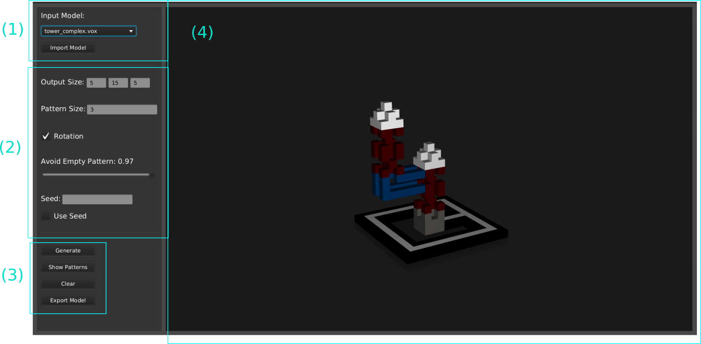

# WFC Voxel Model Generator  
This project contains a 3D-Implementation of the WFC Algorithm by Max Gumin 
(https://github.com/mxgmn/WaveFunctionCollapse) and a UI that allows
loading example Voxel Models, manipulating Parameters of the algorithm aswell 
as export the generated Models. This application was developed as part of a Bachelor-Thesis
in CS at HAW-Hamburg, in cooperation with Prof. Dr. Philip Jenke.

## Setup
### Prerequisites
* **Java JDK 11+** 
* **Maven** 
* **Intellij Idea** (recommended but not  required)
### Project Setup
(1) First clone the master-branch of this Repository:  
```
git clone https://git.haw-hamburg.de/acg303/wfc.git
```
(2) Move into the project directory and install dependencies with Maven
```
cd wfc
mvn install
```
(3) If you see `BUILD SUCCESS` in the output the installation was successful and you
start the application using:
```
mvn javafx:run
```
If you are using an IDE like IntelliJ Idea step 2 and 3 can be skipped. Simply wait until
the IDE has automatically installed all dependencies and run the Main-Class App.java in:
```
src/main/java/org.example/view/App.java
```
## Usage 
